

  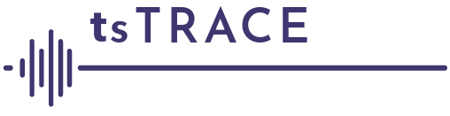

---
    
<h1>
tsTRACE Graphical User Interface Guide
</h1>    
<h4>
DRAFT: 2023.10.18
</h4>    

---

tsTRACE is a JavaScript (more precisely, TypeScript) re-implementation of the Java-based jTRACE (Strauss et al., 2007) re-implementation of the original C version of TRACE (as described by McClelland & Elman, 1986). *This guide applies to using tsTRACE in it's GUI form, via a web browser.* Other guides (will eventually) address local installation (not necessary to use the cloud-based web version), and how to use JavaScript scripts to conduct batch simulations (only possible with a local installation).

## Table of Contents

*   [Introduction](#introduction)
    *    [Purpose](#purpose)
    *    [A brief overview of TRACE](#a-brief-overview-of-trace)

*   [Using tsTRACE](#using-tstrace)
    *   [Quick start](#quick-start)

    *   [Primary tabs](#primary-tabs)
        *   [Config](#config)
            *    [Config-Parameters](#config-parameters)
            *    [Config-Phonology](#config-phonology)
            *    [Config-Lexicon](#config-lexicon)
        *   [Simulation](#simulation)
        *   [Chart](#chart)
        *   [Data tabs](#data-tabs)
            *   [Data-Chart data](#data-chart-data)
            *   [Data-Input](#data-input)
            *   [Data-Features](#data-features)
            *   [Data-Phonemes](#data-phonemes)
            *   [Data-Words](#data-words)
            *   [Data-Levels and Flow](#data-levels-and-flow)
    *    [Save sim data button](#save-sim-data-button)
*    [Notes](#notes)
     *   [Cautionary notes](#cautionary-notes)
     *   [Changes from jTRACE](#changes-from-jtrace)

*   [References (annotated)](#references)
*   [Credits](#credits)
*   [Contact](#contact)

-------------------

# Introduction

## Purpose

The principles behind TRACE seem simple enough: sub-patterns at one level activate corresponding patterns at the next level, feedback allows higher levels to influence lower levels, and lateral inhibition creates competition at each level that keeps activation levels under control. Accordingly, this intuitive structure leads authors to speculate about what TRACE (or some other model) would do if it were applied to their experimental task and materials. This gets at precisely why it is so important not just to implement models, but then to use them. Magnuson, Harris, and Mirman (2012) review a few cases where authors published seemingly logical claims about what TRACE would predict for their studies, but those predictions turned out to be wrong when TRACE simulations were actually run.

This leads us to a crucial point. Why does anyone implement computational models in the first place? TRACE, like many models, is based on very simple elements (biologically-inspired, neuron-like nodes) that follow very simple rules: a node receives input from all nodes from which it has incoming connections, transforms it according to an activation function, and then transmits that output to nodes to which it has outgoing connections. Nodes in TRACE are organized into layers that explicitly represent different levels of linguistic organization (features, phonemes, words), and of course, there are some complex details about the internal structure of those levels (see McClelland & Elman, 1986). But even in very simple systems with just a handful of elements, system behavior becomes difficult or impossible to predict intuitively -- and in many cases, is difficult or impossible to predict analytically. *This is why it is crucial to implement even seemingly simple theoretical proposals as computational models, and then absolutely vital that researchers explicitly test what a model would do via simulation, rather than relying on logic or intuition.*

**The primary reason we have created tsTRACE is to provide researchers with an easy-to-use implementation of TRACE, so that anyone may test what TRACE actually does rather than speculate about what it *should* do.**

The tsTRACE GUI runs directly in a browser. Users can create quite complex simulations and save results directly from the browser. More complex simulations and parameter exploration can be achieved more efficiently by accessing a local tsTRACE implementation via JavaScript code. If you know Python or R or virtually any programming language, you can learn sufficient fundamentals of JavaScript very quickly to do powerful simulations. Even if you have no programming background, JavaScript is a fairly easy language to learn, and we provide example scripts to help you get started.

**A second motivation for creating tsTRACE is for educational purposes.** One of the best ways to gain a deeper understanding of how neural networks operate is by changing inputs, tweaking parameters, and observing the model in operation.

We will conclude this section with some text from the jTRACE manual, written by Ted Strauss, that applies perfectly to tsTRACE.

>  TRACE is a highly influential model of spoken word recognition, created by McClelland and Elman (1986). The original implementation of that model, which we call “cTRACE,” was used to run dozens of simulations comparing TRACE's behavior with results from experimental studies with human subjects. TRACE's behavior accounted for human behavior in a number of important ways, and it is still frequently cited as the canonical interactive-activation model of word recognition.

>  Although TRACE remains highly important, its original implementation, cTRACE, is very difficult to use and even more difficult to extend. For that reason, we have created jTRACE, a re-implementation of the TRACE model in the cross-platform Java language, with a graphical user interface and a number of powerful tools allowing researchers to perform simulations with TRACE easily and flexibly.

--------------
[Return to *Table of Contents*](#table-of-contents)

--------------
## A brief overview of TRACE

To get to know TRACE, you really need to read the original paper (McClelland & Elman, 1986). We would also recommend reading some of the papers we list below in the [References](#references). But we can give you a reasonable idea of how TRACE works with a brief overview, starting from Figure 1 (Magnuson, 2020). This is a schematic that we could call a caricature of TRACE -- it depicts the primary levels and connections, though there is considerably more complexity in the model than the figure suggests. Nonetheless, it's a useful starting point for understanding TRACE conceptually.

  <table class="table" style="border:0px white;margin-left:auto;margin-right:auto;">
    <caption align="bottom">
         Figure 1: A 'caricature' of TRACE, showing layers and connectivity.
      </caption>
    <tr><td>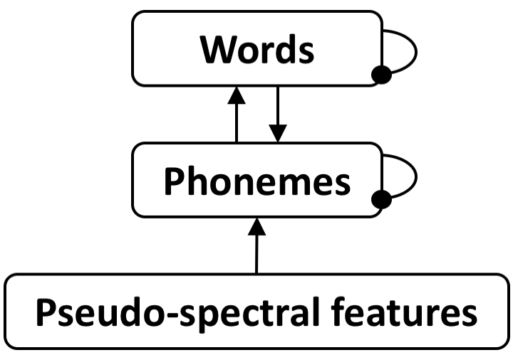</td></tr>
  </table>

The input to TRACE takes the form of *pseudo-spectral features*. Think of these for now as acoustic-phonetic features (like voicing) that are defined as on (present) or off (absent) for different phonemes. McClelland and Elman converted these to "pseudo-spectral" patterns by having features ramp on and off over time, with the constellation of features corresponding to one phoneme ramping on and off together, with some overlap with the features for preceding and following phonemes (giving a rough analog of coarticulation). Figure 2 shows what the pseudo-spectral pattern for /pat/ (POT) looks like. Each of the 7 features has 9 levels, and phonemes can have more than one level of a feature 'on' (and to varying degrees). The darker a cell is, the higher the input value is. We can see that the features for /p/ ramp on and then off, with the center of /a/ close enough to the center of /p/ that their features overlap in time. When adjacent phonemes share a feature, the feature values summate (to a maximum value), as we can see for the third level of *Acuteness* (ACU) for /p/ and /a/. We can also see that /p/ and /t/ have very similar feature patterns, with only a few differences in ACU and BUR.

  <table class="table" style="border:0px white;margin-left:auto;margin-right:auto;">
    <caption align="bottom">Figure 2: TRACE features corresponding to /pat/ (POT). This is a screenshot from tsTRACE.</caption>
    <tr><td>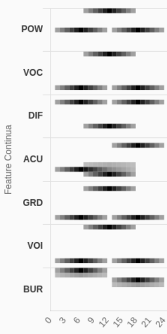</td></tr>
  </table>

Let's consider the connectivity in Figure 1, indicated by lines with arrow or knob connectors. Arrows indicate excitatory (positive) information signals, while knobs indicate inhibition. So note that activations in TRACE can actually flow in *four* directions: forward (features to phonemes to words), backward (words to phonemes), *and left and right* via "lateral inhibition" (where phonemes send inhibition to other phonemes, or words send inhibition to other words, which creates a competition process that tends to lead one unit to dominate at the phoneme and word levels over time).

Often in a neural network diagram, a connection between two layers implies full connectivity (i.e., a connection from every node at the sending level to every node at the receiving level). But TRACE does not use full connectivity. Features have connections only to the phonemes that contain them. Similarly, phonemes only have connections to words that contain them, and words only send feedback to their constituent phonemes.

But this is just the first way that TRACE's complexity exceeds Figure 1. A network like the one in Figure 1 does not have an obvious way to encode temporal order, which is going to be essential for processing over-time input like that shown in Figure 2. Figure 3 (Magnuson, 2018) shows a simple network with just a few phonemes and words.

  <table class="table" style="border:0px white;margin-left:auto;margin-right:auto;">
    <caption align="bottom">Figure 3: A simple network that cannot encode temporal order.</caption>
    <tr><td>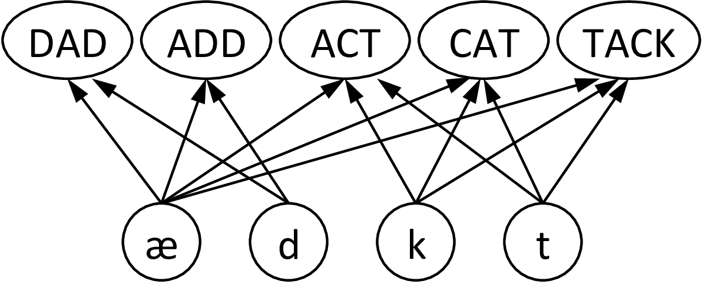</td></tr>
  </table>

If the phonemes /k/, /ae/, and /t/ are activated in series, *in any order*, this network would have no basis to distinguish CAT, ACT, or TAP. At the end of the input, all three words would have received the same amount of input. Various solutions have been proposed in the cognitive and neural sciences, but TRACE takes a unique approach, which we schematize in Figure 4. The TRACE solution is to create a bank of nodes at each level where every unit is reduplicated at all possible positions. As we see in Figure 4, phonemes (by default) have a fixed width, and a word's length is dynamic -- it is proportional to the number of phonemes it has.

  <table class="table" style="border:0px white;margin-left:auto;margin-right:auto;">
    <caption align="bottom">Figure 4: A more accurate diagram of TRACE phoneme and word layers. The feature layer is not depicted; instead, the cells labelled 'k', 'ae', and 't' stand in for the feature patterns, which would be aligned at those positions. Note that by default, TRACE does not actually include the phoneme /ae/, but this example is used because of its relevance for temporal order.</caption>
    <tr><td>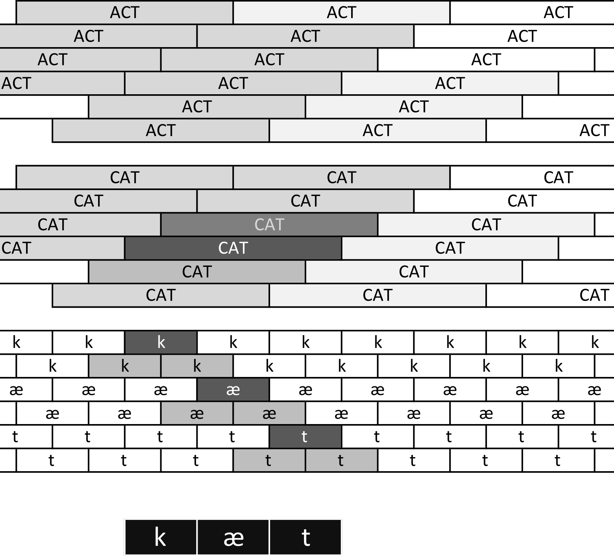</td></tr>
  </table>

In Figure 4, the input is /kaet/ (CAT). This isn't actually a possible word in TRACE, which does not have /ae/ among its original phoneme inventory. However, we use this to be consistent with Figure 3. At the bottom, the 3 black cells stand in for the feature patterns that would correspond to these phonemes. At the phoneme level, we see many copies of each phoneme, tiled so that there is a template for each phoneme at all possible starting positions. In the figure, darker shading indicates greater activation. We see that the copies of /k/, /ae/, and /t/ with maximal alignment to the input are darkest, but the preceding and following copies are also somewhat activated (and in fact, because /k/ and /t/ are similar, the copies of /t/ that overlap with the /k/ input should be weakly activated, and so should /k/ copies that overlap with the /t/ input).

At the word level, we see something similar. The maximally aligned copy of CAT gets the most activation, but so do other copies of CAT that overlap with the activated phonemes. We also see that some copies of ACT get weakly activated.

#### Complexities of lateral inhibition

Now let's consider the complexities of lateral inhibition. Figure 1 suggests all phonemes would be able to send inhibition to all other phonemes, and all words would send inhibition to all other words. In fact, it would be a bad idea for a CAT node to inhibit distant copies of of other words. What if the input is CAT CHASES DOG? Or what if it is CAT LIKES CAT? We want the model to be able to respond strongly to each word in turn. To keep early words from preventing activation of later words, *inhibition is limited to units that overlap in 'time'.* We see this in Figure 5, where the highlighted copy of CAT sends activation only to the highlighted copies of ACT (and it would similarly send inhibition to all other copies of all other words that overlap with it in the 'space' it occupies in the TRACE lexical memory -- i.e., time is translated to space in TRACE's memory).

  <table class="table" style="border:0px white;margin-left:auto;margin-right:auto;">
    <caption align="bottom">Figure 5: The span of inhibition in TRACE.</caption>
    <tr><td>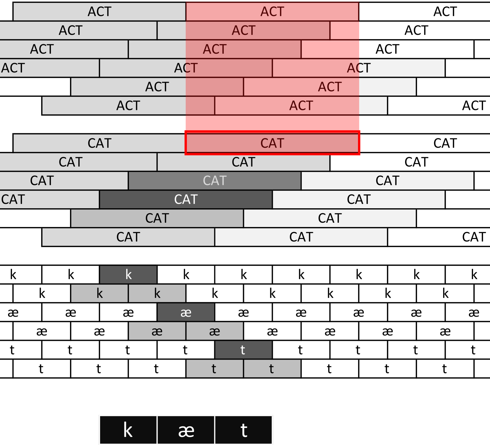</td></tr>
  </table>

We will mention two other wrinkles of inhibition. First, word nodes do not inhibit other alignments of the same word (that is, CAT nodes do not inhibit other CAT nodes, even if they overlap). Second, recall that word nodes occupy a 'space' in lexical memory that is proportional to their length. This means that longer words will overlap with more words, and therefore receive inhibition from more words. This turns out to be why TRACE predicts an initial advantage for shorter words: shorter words are activated more quickly because even tiny amounts of greater inhibition allow them to initially outpace longer words (e.g., CAT will initially activate more quickly than CATTLE, e.g., given activation of /k/ and /ae/ in that order).

With all of this context, we are ready to move on to the tsTRACE simulator.

--------------
[Return to *Table of Contents*](#table-of-contents)

--------------

## Using tsTRACE

Our aim is to make tsTRACE as intuitive as possible, but it's a complex bit of software. We recommend following the steps in [Quick start](#quick-start) to get a sense of how tsTRACE works, and then explore the other sections or refer to them as needed.

--------------
[Return to *Table of Contents*](#table-of-contents)

--------------

### Quick start

* Open tsTRACE. As of this writing, you can access an up-to-date implementation at [https://andrew0.github.io/tracejs]().
* When you follow that link, you land on the [Config](*config) tab (more specifically, the [Config-Parameters](#config-parameters) sub-tab).
* By default, the simulator opens with the default word *ABRUPT* (\-\^br\^pt\-) listed in the *Model input* entry field, with silence phoneme symbols (\-) before and after the phoneme string. You can enter any input in *Model input*, and hit "enter" for *tsTRACE* to read it. It will warn you if you use undefined phonological symbols (and will not run until you remove them).

  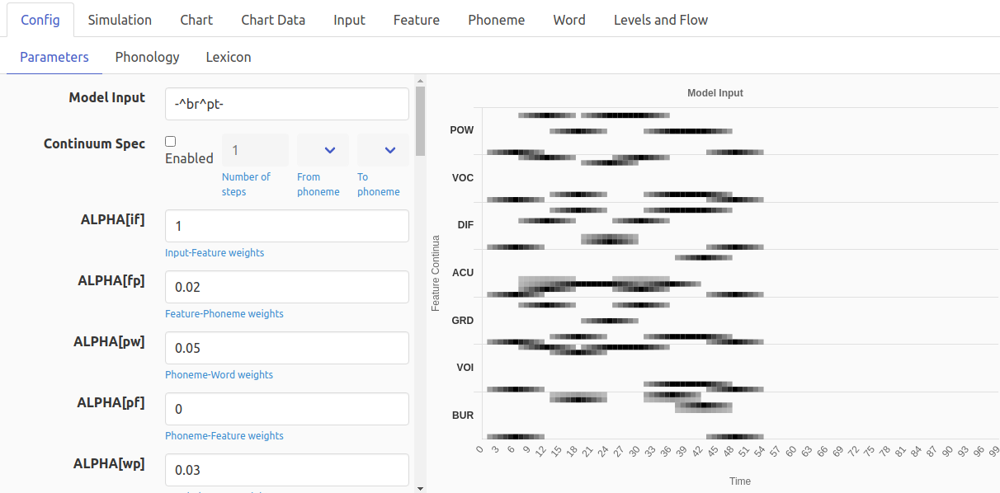

* For details about the various parameters you change here, see  [Config-Parameters](#config-parameters), below.
* To just do a simulation, click on the *Simulation* tab at the top of the window. Now you'll see the Simulation tab, as in the screenshot below. Since we haven't run a simulation, there is nothing to see in 3 of the panels. The *Model Input* **panel** shows what the feature pattern corresponding to the string in the *Model Input* **text entry box**. When we run a simulation, those values will be sent to the Feature level one time slice (column) per time step.

  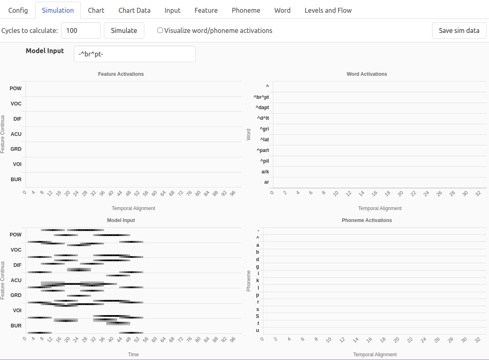

* To run a simulation, click *Simulate*. After a few seconds, the top panel of the screen will change, letting you know that the simulation is done. The simulation runs *very* quickly in the background without animating anything, because you may not always want to take the time to watch the simulation (e.g., if you've just changed a parameter and want to chart the results).

  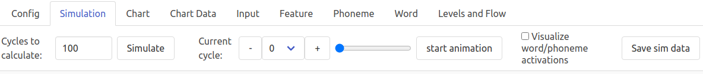

* Now to animate the simulation, you can click on *start animation*. Or you can use the blue slider bulb to scroll through the simulation. Or, you can manually change the 'Current cycle' to look at a specific time step. Here's a screenshot of the animation advanced to cycle 50. Now we see activity happening in all the panels. In the Feature panel, look at the right 'edge' of activation; we are just a few steps before the end of the input, and we can see the latest input slice has strongly activated the corresponding features. Look at the early time steps, though, and compare them to the input pattern. They look different because the inputs were applied for just 1 time step. On subsequent time steps, the feature nodes' activities are a function of any input they receive (which is none after the input 'passes by') but also their previous activation, multiplied by a negative decay parameter. So the nodes gradually turn off as time passes. Whatever activation they have, though, continues to be propagated forward to corresponding phonemes.

  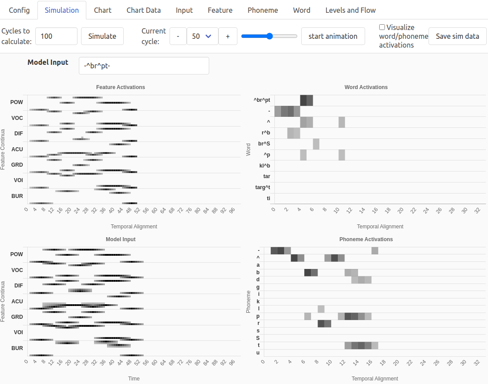

* Now let's look at the phoneme level. There is one row per phoneme. Each copy of each phoneme (there are 33, one starting every 3rd slice) is represented by a single cell. The darker that cell is, the more strongly activated that copy of the phoneme is. We see copies of the silence phoneme (/\-/) strongly activated at early time steps, and copies of /\^/ strongly activated at or adjacent to the locations of features corresponding to /\^/ in the input, strong activation of /b/ and weaker activation of /p/ (which differs only slightly from /b/) at slice 6, etc.

* A similar scheme is used to plot word activations, but only the 10 most activated words are included (and you will see the set change dynamically if you animate the simulation, because the current top 10 can change from cycle to cycle). We can see that the copy of ABRUPT aligned with slice 4 is most active, with fairly high activations for ABRUPT at slice 5, the 'silence word' (\-) at slices 0-3, the 'uh' corresponding to A (/\^/) at slices 4, 5, and 9, RUB (/r\^b/) at slices 2 and 3, etc. We leave it to the reader to infer why these words at these alignments are getting strongly activated by the input /\-\^br\^pt\-/.

* Now try checking the 'visualize word/phoneme activations' box. We get a very different view of phonemes and words. At the phoneme level, we see copies of appropriate phonemes at or just after their locations in the input (with the maximally-aligned copy having higher activation) and some hints at interesting competition (e.g., copies of /b/, /d/, and /t/ activated near word offset). At the word level, we see the very most activated items from the previous screen shot with their left edges aligned with their alignment in that previous screenshot. **Need to fix extent issue and replace figure.**

  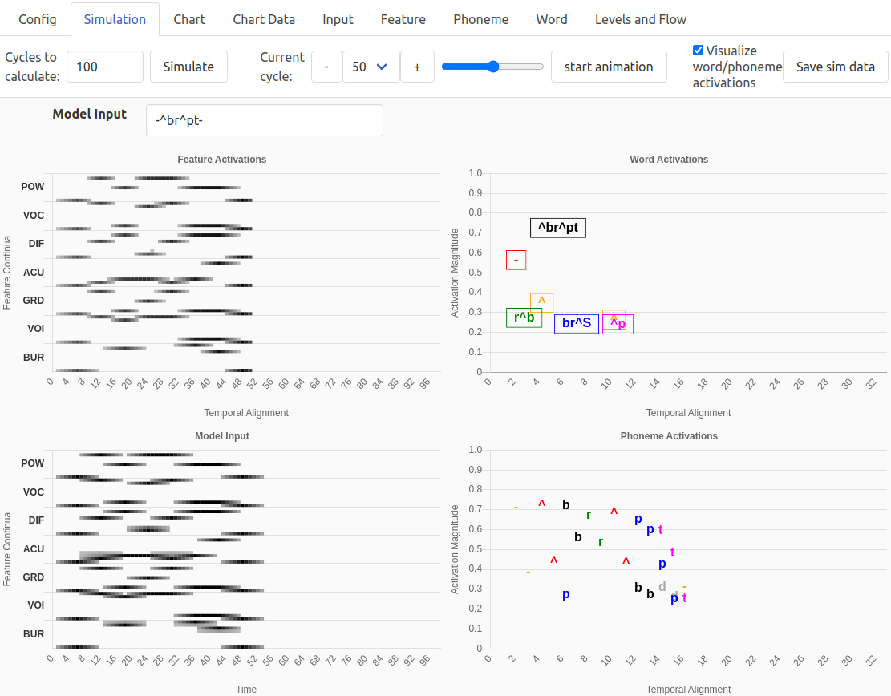

* Next, let's look at the Chart tab. Just click 'Chart', and you should see something like the next screenshot. By default, we will see the activations of the word copies with highest peak activations. The legend at the top tells what copy of what word each line corresponds to. Initially, all items are aligned at position 4 (e.g., *\^br\^pt [4]*) because the default chart mode is to use a specified *Alignment calculation*. There are many things you can explore here. Try changing to *Phonemes*, or from *Activations* to *Response Probabilities*, or from *Specified* alignment to *Max (Post-Hoc)*. Note that if the chart does not update, you can click the 'refresh chart' button. If that doesn't work, resize the window slightly.

  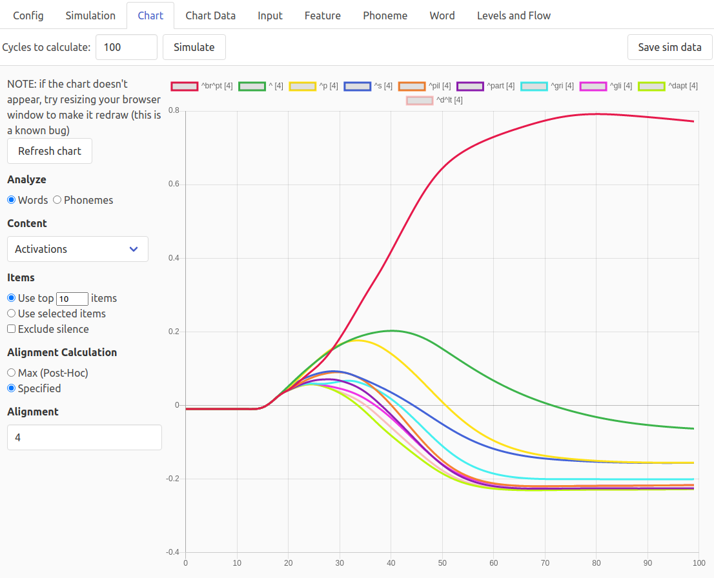

* Note that you can also trigger a simulation from here. So you could switch to the *Confg-Parameters* tab, change a parameter, and then switch back to the Chart tab and click *Simulate*, rather than having to use the *Simulation* tab.

* If you click the *Save sim data* button, you will be able to download a zip file containing CSV records of the input, features, phonemes, words, and "levels and flow" data. You can explore those data These are explained in sections below.

* The data for the chart with your parameters is available under the *Chart Data* tab, where you can examine or save it.

--------------
[Return to *Table of Contents*](#table-of-contents)

--------------

## Primary tabs

In the sections below, we describe details of each *tsTRACE* tab.

### Config

The *Config* tab brings you to 3 sub-tabs, described below ([Config-Parameters](#config-parameters), [Config-Phonology](#config-phonology), and [Config-Lexicon](#config-lexicon)).

If you make any configuration changes in any of the Config tabs, the Config label will be changed to *Config [\*]*

#### Config-Parameters

The screenshot below shows the top part of the *Config-Parmeters* sub-tab. The scrollbar in the middle of the screen allows you to advance through the full feature list in the feature panel (which has the *Model Input* text field at the top).

Before going through the parameter that you can change, we simply note that the model input panel displays input corresponding to text in the *Model Input* text field. If you change the contents of that field, hit 'Enter' on your keyboard for it to register, and you will see the *Model Input* **panel** update.

  

* *Model input* field. You can type directly into this field to change the input, and then press "Enter" on your keyboard to update.

* *Continuum spec* (continuum specification) controls:
    * Click the checkbox to enable this function.  
    * Then choose the endpoint phonemes using the *from phoneme* and *to phoneme* dropdown menus.
    * Then set the number of continuum steps. This creates temporary phoneme definitions that are weighted averages of two phonemes.
        * For example, if you choose 3 steps, 3 new phonemes will be created, with the labels 0, 1, and 2. 0 will be identical to 'from phoneme', 2 will be identical to 'to phoneme', and 1 will be a 50/50 combination of the two. If you ask for 4 steps, 0=from phoneme, 3=to phoneme, 1=67\% from and 33\% to, while 2=33\% from and 67\% 2.  
    * You specify continuum steps using the number labels. For example, if 'from phoneme' is /a/ and 'to phoneme' is /\^/, and number of steps is 3, you could specify a continuum from /rab/ (ROB) to /r\^b/ (RUB) as r0b, r1b, r2b.

#### *Model parameters*

<mark>
Note that more details about parameters is available in the
document 'The Structure of TRACE' that is being released
along with tsTRACE.
</mark>

The remaining items in this panel are model parameters. If you change any of these, a 'reset' button will appear. Crucially, the 'reset' returns to the previously specified value for the feature, *not* the default. Currently, if you need a return to *all* defaults, you must change each one back manually or simply reload the GUI.

* **ALPHA** (between-level gain) parameters: these are **if** (input to features), **fp**  (features to phonemes), **pw** (phonemes to words), **pf** (phonemes to features), and **wp** (words to phonemes).

* **GAMMA** (lateral inhibition) parameters: there are separate values for **f** (feature level), **p** (phoneme level), and **w** (word level). Gamma parameters control how strongly nodes within a layer *with positive activations* inhibit nodes within the layer. Note that nodes do not inhibit other copies of the same type (one CAT node does not inhibit another) and nodes only inhibit nodes with templates that have overlapping 'temporal' extent within the layer (e.g., CAT would inhibit DOG nodes at the same alignment and any preceding or following alignment where the receiving template's onset or offset falls within the range of the onset and offset of the sending template; see [Complexities of lateral inhibition](#complexities-of-lateral-inhibition))

* **DECAY** parameters: there are separate values for **f** (feature level), **p** (phoneme level), and **w** (word level). These control how much a node's previous activation continues at the current time step.

* **REST** (resting level) parameters: there are separate values for **f** (feature level), **p** (phoneme level), and **w** (word level). These define the default resting (starting) activation level of nodes within a layer (though nodes' actual resting levels might be changed depending on whether frequency or priming are active).

* **Input Noise**. Standard deviation of Gaussian noise with mean of 0.0 to add to all input nodes. See Magnuson et al. (2018) for an example.

* **Stochasticity**. Standard deviation of Gaussian noise with mean of 0.0 to add to **all** nodes of the model at each time step. See McCelland (1991). McClelland reports that a value of 0.02 adds a substantial amount of noise.

* **Attention (lexical gain).** Allows a type of lexical emphasis. See Mirman et al. (2014).

* **Bias**. Also from Mirman et al. 2014. NEEDS TO BE COMPLETED, ALONG WITH ITEM ABOVE.

* **spreadScale**. Scales all FETSPSREAD parameters listed below. Default = 1.0.

* **min, max**. Minimum and maximum activation values; -0.3 and 1.0 by default.

* **frq resting levels (*s*)**. Modifies the frequency level of each word to be proportional to its frequency, such that higher frequency words have greater resting activation levels (relative to the default). *See Dahan, Magnuson, & Tanenhaus (2001, p. 335) for details.* Resting level for word *i* (*ri*) is scaled according to the following formula, where *R* is the default resting level for words, *s* is the frequency scaling constant specified **for this parameter**, *c* is a constant (set to 1.0 in the code to avoid taking the log of 0, though users could still insert problematic values, and *error-checking needs to be added to make the code robust*), and *fi* is the frequency (occurrences per million words) of word *i*. Dahan et al. reported robust results using a value of 0.06 for this parameter **in conjunction with** setting the resting level for words to -0.3.

  *ri = R + s [ log10 ( c + fi ) ]*

* **Frq phoneme->word weights (*s*)**. Modulates connection weights from phonemes to words to make them proportional to word frequency. *See Dahan, Magnuson, & Tanenhaus (2001, p. 337) for details.* The connection weights are modulated by the following formula, where *api* is the standard calculation of activation to lexical unit *i* from phoneme node *p*, *a'pi* is the modified activation, *s* is the scaling constant specified **for this parameter**, *c* is a constant (set to X in the code) and *fi*  is the frequency (occurrences per million words) of word *i*. Dahan et al. used a *s* = 0.13 in their simulations.

  *a'pi = api [ 1 + s ( api [ log10 ( c + fi ) ] ) ]*

* **Frq post act (*c*)**. While the *rest* and *weight* frequency implementations change activations *within the model*, the *post-activation* method only applies frequency at the decision stage, by using the Luce Choice Rule. Normally, the way you calculate response probabilities with the Luce Choice Rule is to calcluate a *response strength*, *S*, from each activation, *a*, where *S = eka* (where *k* is a constant scaling parameter). Then you sum all response strengths and normalize (divide each *S* by the sum). The difference with *frq post act* is we scale the response strengths by frequency first, using this simple change to the formula (where *c* is **the value specified for this parameter** and *fi*  is the frequency [occurrences per million words] of word *i*). *See Dahan, Magnuson, & Tanenhaus (2001, p. 338) for details.* Dahan et al. report that a value of 15 for *c* worked well.

  *S = eka  [ log10 ( c + fi ) ]*

* **Priming (rest, weight, & post-act)**. These operate following the principles of the frequency parameters with analogous names (note that you should not use the post-act version as it has not been validated yet). However, you must specify a discrete value for *every* word (default = 0). Then, in every place where *fi* is specified in the formulae for frequency implementations, the word-specific priming value will be used, scaled by the value of *s* (for rest or weight) or *c* (for post-activation) that you specify. Note that you can make tsTRACE behave very strangely via these mechanisms, so be careful in choosing parameters. Here is some advice for the different methods. 

    * *Priming (rest)*: for resting level priming, you might set the prime value for a word to 100 and *Priming (rest)* to 0.06 (as for resting-levels linked to frequency) -- but if you do not change the default resting level, this would give your primed item a very high resting activation (around 0.12). But if you change the default resting level to -0.3 (as Dahan et al. did when linking resting-levels to frequency), you get more sensible results. You must explore the impact of your specific parameters before drawing strong conclusions. (In brief trial-and-error exploration, we find that prime values of about 1 with a Priming(rest) value of 0.01 and defalut resting level of -0.3 works well, and raises the primed items resting level to approximately 0). 

    * *Priming (weight)*: this has a very subtle impact. Since it changes phoneme-to-word weights for primed words, it has no impact until bottom-up input arrives. Setting this to 0.13 (as Dahan et al. did for this variant of frequency) and setting the prime for a word to 10 has a noticeable impact.

    * *Priming (post-act)*: This is an experimental feature that has not been validated yet. Do not use it.

* **FETSPREAD (pow, voc, acu, gra, voi, bur)**. How far from the center of a phoneme do features values spread left and right (ramping up from the minimum feature value to the maximum and back down).

* **fSlices**. Number of time slices to allow the model to run. Default = 99, current maximum possible = 287.

* **deltaInput**. Interval at which phonemes are presented to the model. Default = 6. We are unaware of explorations of this parameter.

* **nreps**. Number of time slices per model cycle. Default = 1. We are unaware of explorations of this parameter.

* **slicesPerPhon**. Number of (input) time slices per phoneme time step. Default = 3. We are unaware of explorations of this parameter.

* **lengthNormalization**. Turn off/on (0/1) normalization of length biases inherent in TRACE's lexical competition. Experimental and untested. User beware. See [Cautionary Notes](#cautionary-notes).

--------------
[Return to *Table of Contents*](#table-of-contents)

--------------

#### Config-Phonology

At this tab, you will see a display as in this screenshot.

  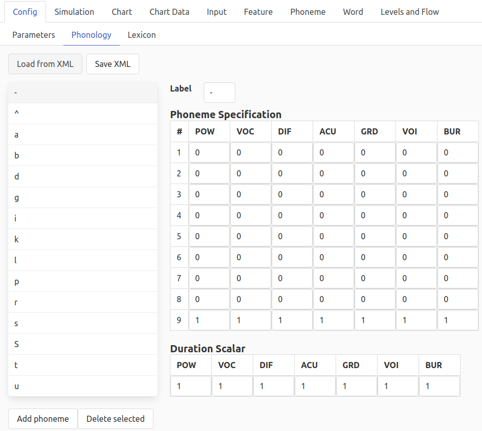

* *Load from XML* allows you to replace the current phonology parameters with ones you read in from an XML file.

* *Save XML* saves the current phonology parameters to an XML file with a ".jt" extension.

* Phoneme editor
    * Click on a phoneme and then you can change the label, or change its feature definitions.
    * In the screenshot, the silence phoneme (/-/) is selected, which would allow you to change its label or features.
    * *Add phoneme* creates a new phoneme, with a 'null' label and all zeroes for all features. Edit to create the new phoneme.
    * *Duration scalar* fields: these currently do not work properly. We recommend not using them. They will be repaired in a future release..

    * *Delete selected* does exactly what it implies!
        * Note that there is not an 'undo' function here; you could simply reload the webpage to go back to defaults, though note that you would destroy any other changes you have made.

--------------
[Return to *Table of Contents*](#table-of-contents)

--------------

#### Config-Lexicon

The Lexicon window has 3 buttons (*add word*, *load from XML*, *save XML*). See screenshot below that shows just the first few rows of the lexicon.

* *Add word* adds a row at the top with the "Lexical Items" field blank and frequency and priming set to 0. Note that by default, freuency and priming are turned off; see relevant parameters in [Config-Parameters](#config-parameters).

* *Load from XML* allows you to replace the current lexicon with one you read in from an XML file.

* *Save XML* saves the current lexicon to an XML file with a ".jt" extension.

  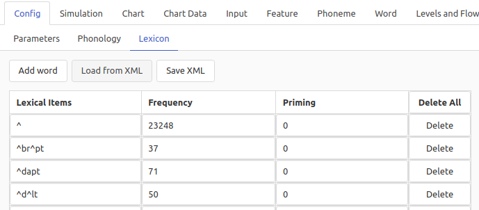

If you save the lexicon, you will get a .XML like this, which has been edited to only include 2 words. To keep file size small, the value for Priming is only included if it is not 0. In this case, we have actually edited the XML file after saving it. If we read this in using *Load from XML*, we'll see that Priming = 1 for the first word, but 0 for the second, even though no Priming value was specified for the second word in the file (or rather, because no value was specified).

  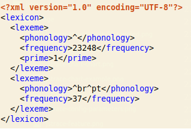

Note that there is currently no error checking when you add words or load XML; if phonology is specified with illegal characters (symbols not defined in Phonology) there is no warning, unless you try to enter those characters into a *Model input* field.

In the lexicon screen, there are 2 kinds of **Delete** buttons.

* *Delete all*, in the Table header, deletes all words. There is no 'undo' for this. To reload the default lexicon, you can just reload the entire 'page' (refresh in your browser). Alternatively, you could save the XML before you make any changes, and then reload it if needed.

* *Delete* in each row will delete that row. Again, there is no 'undo' for this.

--------------
[Return to *Table of Contents*](#table-of-contents)

--------------

## Simulation

* *Cycles to calculate*. Enter a value to change the total number of cycles in the simulation. Maximum (for historical reasons) is 287. This is more than enough for most purposes. This maximum could be changed in the source code, but would impose higher memory demans.

* *Simulate*. Run a new simulation with the current parameters (those defined under the 3 *Config* tabs, as well as any changes to *Model input* or *Cycles to calculate* on the *Simulation* tab). When you click this button, you will see the button outline turn dark during processing, and return to light grey when it is done. If *Current cycle* is set to a value where the new parameters cause a change in any of the graph panels, you will see the graphs update.

* *Current cycle* controls. You can use the dropdown control to select a specific cycle, or use + and - to step through cycles. Or you can use the slider to drag through the cycles going forward or backward.

* *Start animation* button. This will step through the simulation data cycle-by-cycle, starting from the cycle listed in *Current cycle*. The rate is predetermined and not under user control.

* *Visualize word/phoneme activations* checkbox. If this box is checked, you will see the "floating box" representations of words and phonemes (based on Figure 5 [among others] from the original TRACE paper [McClelland & Elman, 1986]). See *graph* descriptions below for more details.

* The [*Save sim data* button](#save-sim-data-button) always does the same thing.

* *Model input* field. You can type directly into this field to change the input, and then click *Simulate* to run a simulation with the new input.   

* *Input graph*. his displays a static representation of the input matrix. When you run a simulation, the input matrix is presented column-by-column (one column per time step) to the feature level. Darker grey indicates higher input values, white indicates 0. The X-axis is in *feature time slices*.

* *Feature graph*. This depicts the feature activations.here is one row for each level of each feature (9 levels for each of 7 features with the default TRACE parameters). Darker grey indicates higher activation. Only activations > 0 are indicated (cells with activation <= 0 are white). X-axis is in *feature time slices*.

* *Phoneme graph*. This depicts phoneme activations. The X-axis is *phoneme time slices* (by default, 1 for every 3 *feature time slices*).

    * If *Visualize word/phoneme activations* is not checked, there is one row for each phoneme. In each row, each column represents another of the 33 copies of that row's phoneme. The darker the cell, the higher the activation.

    * If *Visualize word/phoneme* activations is checked, "floating phoneme" mode is activated. Now phoneme nodes with activations > 0.25 are plotted, with y-axis height indicating activation.

* *Word graph*. X-axis is in *word time slices* (by default, 1 for every 3 *feature time slices*).

    * If *Visualize word/phoneme activations* is not checked, there is one row for each of the 10 words with highest peak activation. In each row, each column represents another of the 33 copies of that row's word. The darker the cell, the higher the activation. Note that cells occupy one unit width, but words have temporal extent proportional to their number of phonemes. This can be made apparent by checking *Visualize word/phoneme activations*. See [Quick start](#quick-start) for some more details about the nature of word units.

    * If *Visualize word/phoneme* activations is checked, "floating word" mode is activated. Now the 10 word nodes with highest activations > 0.25 are plotted, with y-axis height indicating activation.

--------------
[Return to *Table of Contents*](#table-of-contents)

--------------

## Chart

* *Cycles to calculate*. Enter a value to change the total number of cycles in the simulation. Maximum (for historical reasons) is 287. This is more than enough for most purposes. This maximum could be changed in the source code, but would impose higher memory demans.

* *Simulate*. Run a new simulation with the current parameters (those defined under the 3 *Config* tabs, as well as any changes to *Cycles to calculate* here or on the *Simulation* tab, or the *Model input* field in the *Simulation* tab). When you click this button, you will see the button outline turn dark during processing, and return to light grey when it is done. If *Current cycle* is set to a value where the new parameters cause a change in any of the graph panels, you will see the graphs update.

* The [*Save sim data* button](#save-sim-data-button) always does the same thing.

* *Refresh chart*: click this when you change any chart parameters to update the chart. If the chart does not update after a few seconds, resizing the window slightly should force the update.

* *Analyze (words or phonemes)*: Change which level's units are being charted.

* *Content*

    * **Activations**: Default; raw unit activations.

    * **Response probabilities**: This converts activations to response probabilities using the Luce (1959) Choice Rule (LCR).

        * First, we convert activations to response strengths:
          <pre>
                Si = ekai
          </pre>

          that is, we raise *e* to the power of *k* times the activation of element *i* to get the response strength (*S*) of element *i*.

             * *k* is the scaling constant for the LCR; when you select *Response probabilities*, an entry box appears where you can specify its value.

        * Second, sum all response strengths.

        * Third, we convert each response strength to a response probability by dividing each response strength by the sum of response strengths.

        * When you have selected 'Response Probabilities', new controls appear for specifiying *k* and also for choosing to apply the Luce Choice rule to *all items* (all items in the lexicon) or *forced choice*, which will restrict the computation to items selected using the *Use selected items* or *Use top X items* interfaces.

        * ``NB: this is softmax with a scaling parameter (k) applied to activations``

    * **Competition index**.When competition index is selected in the content type, jTRACE sums the total amount of competition acting within the word (or phoneme) layer at the current time cycle. When *Raw* is selected from the drop-down menu, that summed value is plotted directly. When *First-Derivative* is selected, a slope regression operation is applied to the competition data to determine the rate of change of competition over time; this is plotted. If *Second-Derivative* is selected, the slope regression is applied twice, first to the raw data, then to the *First-Derivative*, approximating the acceleration of competition. The calculation of slope is done with this equation:

      <pre>
               b = SUM[(x-avg(x))(y-avg(y))] / SUM[(x-avg(x))^2]
      </pre>

      where *x* is the time axis, simply incrementing from 1 to the number of cycles in the simulation. And _y_ is the competition value. Because the slope equation requires averaging over a range of values, in order to approximate the slope within that range of values, we must decide the width of that range, i.e., how much of the curve to approximate at a time. The numeric parameter labeled 'sample width' sets that value. Larger values here will lead to smoother curves.

        * Note that the raw *Competition index* corresponds to the *LexicalCompetition* field in [Levels and Flow](#data-levels-and-flow) data.

* For *Activations* and *Response probabilities*, you can also control *Items* included and *Alignment*

    * Items:
        * *Use top*: You can specify any value here, though the chart can only provide 22 unique colors. If you want to do plots with more items or finer control, export the data and use another tool.

        * *Exclude silence*: If this is checked, the silence word or phoneme will not be included in the chart. If it is among the top X items, however, you will only see the others X-1 items.

        * *Use selected items* (only for words): place a check next to each item to include.

    * Alignment:
        *  The default *Alignment calculation* is to use a specified alignment. 4 is the default, as this is where a target word preceded by the silence phoneme would be aligned. This only considers word units aligned at this position.

        * *Max post-hoc*: This considers words at any alignment, but currently only considers one copy per word. It is post-hoc since words are selected based on their peak over the entire simulations

        * NB: *jTRACE* had additional options. We have removed them after seeing them used improperly in publications. Users interested in using those options can calculate them after the fact from saved output, but we do not think it is wise to make them available by default.

--------------
[Return to *Table of Contents*](#table-of-contents)

--------------

## Data tabs

The Data tab provides 6 subtabs, described below.

### Data-Chart data

* The *Chart data* sub tab shows the exact data used at the moment to drive the chart on the *Chart* tab. In the example below, we see there is one column for 'cycle', and then 1 column for each word that is included in the plot. We can tell that the user has selected the 'Max (Post-Hoc)' alignment since we see words with a variety of alignments.

  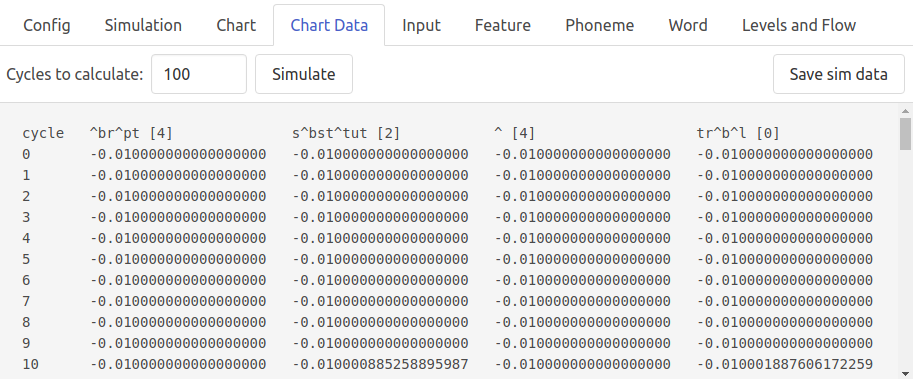

* Note that you can trigger a simulation from here (by clicking *Simulate*), which you might want to do if you just want to tweak a parameter and then jump here to examine the raw chart data or save it.

* You can *Save sim data*, which will allow you to download the data in the window to a CSV file. **CURRENTLY, THIS ACTUALLY JUST DOES THE SAME THING AS OTHER SAVE SIM DATA BUTTONS AND DOES NOT SAVE THE CHART DATA.**

--------------
[Return to *Table of Contents*](#table-of-contents)

--------------

### Data-Input

* This page displays the input pattern, which is a  features (+1 for the cycles column) x cycles matrix. Currently, this tab includes animation controls, but the input pattern is fixed. Although it is applied one row at a time to the Features layer, the input matrix is predefined and does not change. (This issue is noted as a desired future change.)

* The [*Save sim data* button](#save-sim-data-button) always does the same thing.

  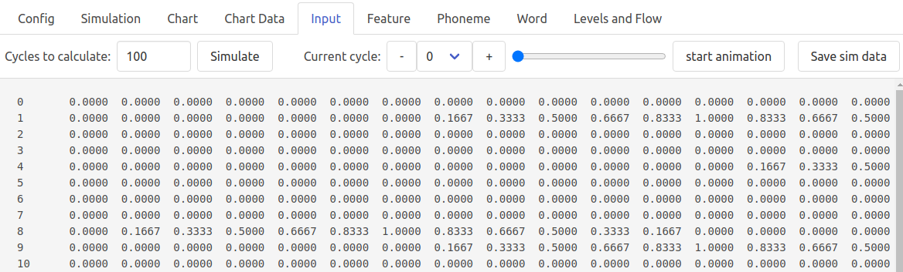

--------------
[Return to *Table of Contents*](#table-of-contents)

--------------

### Data-Features

* This page displays the feature state matrix, which has one column for Feature Number (by default, from 0-62 for the 63 default TRACE features) and then 99 columns for each *feature time slice* (which is a user-settable parameter, so the number can change).

* The feature matrix for one cycle of the simulation is shown. Use the *Current cycle* controls to specify the cycle to display or step from one cycle to another. Or use the *start animation* button to step through cycles from the current cycle to the last cycle.

* The [*Save sim data* button](#save-sim-data-button) always does the same thing.

  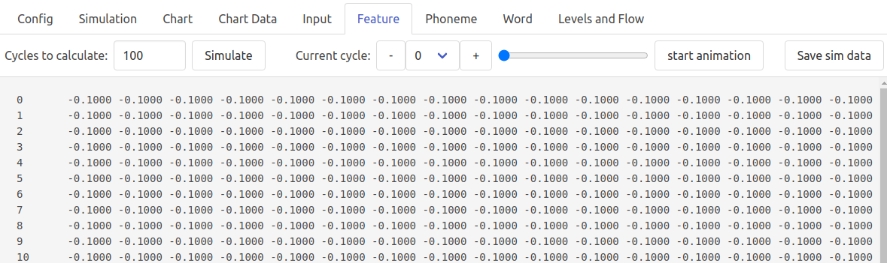

--------------
[Return to *Table of Contents*](#table-of-contents)

--------------

### Data-Phonemes

* This page displays the phoneme state matrix, which has one column for Phonemes (by default, the original 14 TRACE phonemes) and then 33 columns for each *phoneme time slice*; note that the default ratio of *feature time slices* to *phoneme time slices* is 3-to-1, so with default settings, there will be 33 phoneme time slices.

* The phoneme matrix for one cycle of the simulation is shown. Use the *Current cycle* controls to specify the cycle to display or step from one cycle to another. Or use the *start animation* button to step through cycles from the current cycle to the last cycle.

* The [*Save sim data* button](#save-sim-data-button) always does the same thing.

  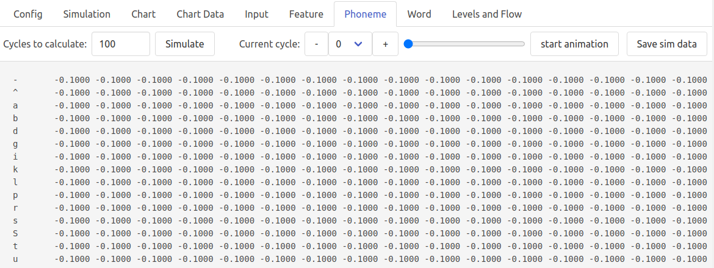

--------------
[Return to *Table of Contents*](#table-of-contents)

--------------

### Data-Words

* This page displays the word state matrix, which has one column for Words (by default, the original 212 TRACE words, but whatever words are in the current lexicon will be listed) and then 33 columns for each *word time slice*; note that the default ratio of *feature time slices* to *word time slices* is 3-to-1 (as for *phoneme time slices*), so with default settings, there will be 33 word time slices.

* The word matrix for one cycle of the simulation is shown. Use the *Current cycle* controls to specify the cycle to display or step from one cycle to another. Or use the *start animation* button to step through cycles from the current cycle to the last cycle.

* The [*Save sim data* button](#save-sim-data-button) always does the same thing.

  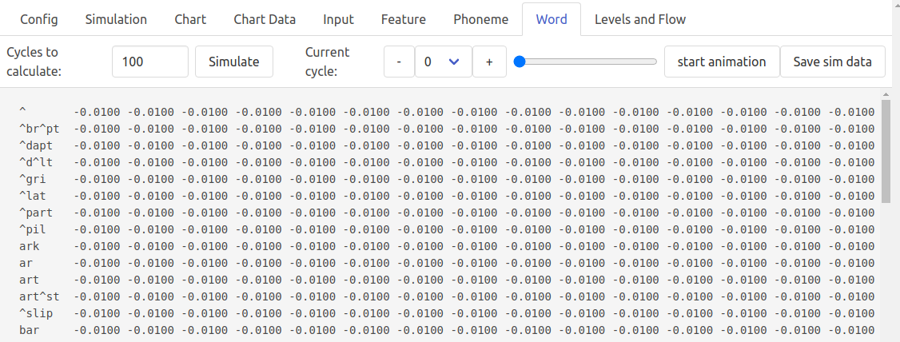

--------------
[Return to *Table of Contents*](#table-of-contents)

--------------

### Data-Levels and Flow

* A new feature in *tsTRACE* is tracking of activation within levels and flowing between them. This can be useful when trying to relate relatively global activity to, e.g., neural activity (see Luthra et al., 2021).

* The [*Save sim data* button](#save-sim-data-button) always does the same thing.

* The columns are cycle, and then 13 data columns (described below the screenshot). These are each calculated once per cycle, so there is only 1 page of output, with one row per cycle, and nothing to step or animate through.

  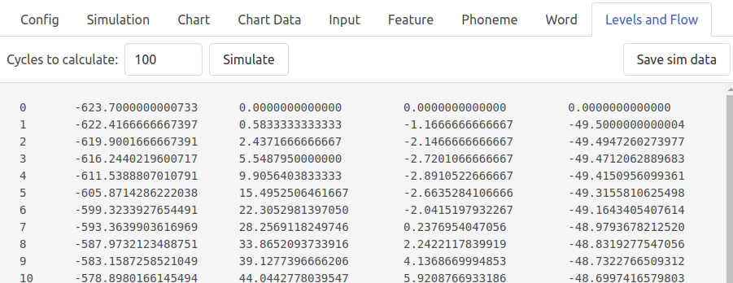

**Data columns in levels-and-flow**

1. FeatureSumAll: Sum of all units in the feature level.

2. FeatSumPos: Sum of positive activations in the feature level (excludes zeroes and negative values, which one might want to do since nodes with negative values may still be at resting state)

3. FeatureCompetition: Sum of inhibition being transmitted within the feature level.

4. PhonSumAll: Sum of all units in the feature level.

5. PhonSumPos: Sum of positive activations in the feature level (excludes zeroes and negative values, which one might want to do since nodes with negative values may still be at resting state)

6. PhonemeCompetition: Sum of inhibition being transmitted within the phoneme level.

7. WordSumAll: Sum of all units in the word level.

8. WordSumPos: Sum of positive activations in the word level (excludes zeroes and negative values, which one might want to do since nodes with negative values may still be at resting state)

9. LexicalCompetition: Sum of inhibition being transmitted within the word level.

10. FeatToPhonSum: Total activity flowing from features to phonemes.

11. PhonToFeatSum: Total activity flowing from phonemes to features (is zero by default).

12. PhonToWordSum: Total activity flowing from phonemes to words.

13. WordToPhonSum: Total activity flowing from words to phonemes.

--------------
[Return to *Table of Contents*](#table-of-contents)

--------------

## Save Sim Data button

* Several tabs include the *Save sim data* button.

* If you click the *Save sim data* button, you will be able to download a zip file containing CSV records of the input, features, phonemes, words, and "levels and flow" data. You can explore those data These are explained in sections above.

* One key difference between the descriptions above and the data in the CSV files is that the CSV files include an extra column showing what the *Model input* was for the simulation.

--------------
[Return to *Table of Contents*](#table-of-contents)

--------------

# Notes

### Button Behavior

When you click a button in the *tsTRACE* simulator, the button outline will get darker while processing is happening. It will go back to its original lighter outline when it is done -- but some note that there may be an additional delay when you are downloading simulation data (after the data is compiled, the browser must manage the download process). Pressing the button multiple times will not help! Some processes can take several seconds, such as running a new simulation (depending on parameters) or saving simulation data (which may take 30 seconds or more depending on simulation parameters).

When in doubt, wait.

If you click a button more than once, you typically just create a queue of multiple requests to repeat the same operation, without interrupting the current process. Clicking the download button repeatedly may create browser warnings or errors due to the page trying to start multiple downloads.

--------------
[Return to *Table of Contents*](#table-of-contents)

--------------

## Cautionary notes

**Length normalization.** In TRACE, there is a natural long-word bias due to longer words receiving more total input than shorter words. This emerges late in a word's activation. However, there is also a very interesting, emergent short-word bias in the early timecourse. This is a by-product of the temporal representation of words. Recall that word nodes only receive inhibition from word nodes with which they 'overlap' in time. This means that longer words have more "sites of inhibition", i.e., more opportunities to be inhibited by other words. With larger lexicons, one might speculate that these length effects could have undesirable effects on processing (though apparent analogs of both effects have been attested in studies with human subjects). A simple form of length normalization has been implemented that can be turned on using this parameter. This is an experimental feature. Use and interpret at your own risk.

How does length normalization work?

*   If *TINHIB* is the amount of inhibition being applied to target *T*, of length *LT*, then we transform *TINHIB* as follows.
    *   *LMEAN* is the mean word length in the current lexicon.
    *   ß = 1 / LMEAN
    *   If ß \* LT > 1, then this word is longer than the mean length, so we  **normalize**: *TINHIB* =  *TINHIB* / (ß \* LT)
    *   Else (ß \* LT <= 1): no transformation

--------------
[Return to *Table of Contents*](#table-of-contents)

--------------

## Changes from jTRACE

* **Major changes.** There were some really beautiful things about *jTRACE* that we have not carried over to *tsTRACE*. The three major ones are the ability to work with multiple simulations simultaneously within the Java application window, including the ability to clone a window at any time (which allowed you to do things like tweak a parameter and compare the two windows side-by-side), the on-board scripting system (not included in *tsTRACE*), and the "gallery" of classic simulations that were built-in.

     *  The multiple-instances feature was sacrificed in favor of the flexibility of being able to run *tsTRACE* in a browser window. You can still set up multiple instances in multiple windows, though it takes more work. But we think this trade-off brings a lot of value.

     *  The scripting facilities in *jTRACE* were ambitious and really powerful, but frankly, we ran out of funding before we could make them user friendly. We have scrapped that approach with *tsTRACE*. Instead, with just a modicum of programming skill that most users will be able to acquire, JavaScript code can be used to create infinite varieties of scripts.

     * The gallery concept does not work with *tsTRACE*. We aim to implement several classic simulations in JavaScript and create a code repository where we can share them, and other users can share their own scripts.
* **Other changes.**
    * Removed *Input* panel -- it was quite complex and probably not used much.
    * *Phonemes* tab: removed "Languages" option and more generally got away from hard-coding of default features. In *tsTRACE*, you can load in XML or JSON files specifying phonology and lexicon.
    * *Graphing* (*Chart*):
        * Removed complex alignment options (max ad-hoc, which would select the copy of each word at each time step with maximum activation *at that time step* which was experimental but really not sensible, in retrospect).
        * Also removed the "Frauenfelder" method of combining nodes with their right-adjacent copy (since the maximally-aligned and right-adjacent copies tend to be highly activated together). This seems rarely used, and better left to advanced users to implment at the analysis stage.

--------------
[Return to *Table of Contents*](#table-of-contents)

--------------

# References

*   Dahan, D., Magnuson, J.S., & Tanenhaus, M.K. (2001). Time course of frequency effects in spoken-word recognition : evidence from eye movements. Cognitive Psychology, 42, 317–367.

*   Dahan, D., Magnuson, J.S., Tanenhaus, M.K., Hogan E.M. (2001b). Subcategorical mismatches and the time course of lexical access: Evidence for lexical competition. Language and Cognitive Processes, 16(5/6), 507-534.

*   Frauenfelder, U. H. & Peeters, G. (1998). Simulating the time course of spoken word recognition: an analysis of lexical competition in TRACE. In J. Grainger and A. M. Jacobs (Eds.), Localist connectionist approaches to human cognition (pp. 101-146). Mahwah, NJ: Erlbaum.

*   Ganong, William F. (1981). Phonetic categorization in auditory word perception,. Journal of Experimental Psychology: Human Perception and Performance, 6 (1), 110-125.

*   Luce, R. D. (1959). Individual choice behavior,. New York: Wiley.

*    Luthra, S., Li, M. Y. C., You, H., Brodbeck, C., & Magnuson, J. S. (2021). Does signal reduction imply predictive coding in models of spoken word recognition? Psychonomic Bulletin & Review. https://doi.org/10.3758/s13423-021-01924-x

*    Magnuson, J. S. (2018a). simple_network_diagram.pdf (Version 1). figshare. https://doi.org/10.6084/m9.figshare.5852532.v1

*    Magnuson, J. S. (2018b): Complex TRACE schematic, version 3. figshare. Figure. https://doi.org/10.6084/m9.figshare.7205093.v1

*    Magnuson, J. S. (2018c): Complex TRACE schematic depicting inhibition span. figshare. Figure. https://doi.org/10.6084/m9.figshare.7205096.v1

*    Magnuson, J. S. (2020): Very simple TRACE schematic REVISED. figshare. Figure. https://doi.org/10.6084/m9.figshare.12410420.v1

*   Magnuson, J.S., Strauss, T.J., Harris, H.D. (2005). Feedback in models of spoken word recognition : Feedback Helps. Proceedings of CogSci 2005, Stresa, Italia. Cognitive Science Society.

*   Magnuson, J.S., Dahan, D., & Tanenhaus, M. K. (2001). On the interpretation of computational models: The case of TRACE. In J.S. Magnuson & K.M. Crosswhite (Eds.), University of Rochester Working Papers in the Language Sciences, 2(1), 71– 91.

*   McClelland, J.L., & Elman, J. L. (1986).The TRACE model of speech perception. Cognitive Psychology, 18, 1-86.

*   McClelland, J.L. (1991). Stochastic interactive processes and the effect of context on perception. Cognitive Psychology, 23, 1-44.

*   Marslen-Wilson, W., & Warren P. (1994). Levels of perceptual representation and process in lexical access. Psychological Review, 101, 653– 675.

***

[Return to *Table of Contents*](#table-of-contents)

***

# Credits

* Development of *tsTRACE* was supported by NSF grant 1754284 to James Magnuson and Jay Rueckl. Magnuson's effort was also supported by SPANISH GRANTS.

*  *tsTRACE* was engineered in TypeScript by Andrew Curtice with input and user testing from Jim Magnuson. Samantha Grubb and Anne Marie Crinnion worked with Magnuson to create our first JavaScript scripts for *tsTRACE* simulations.

* Curtice used *jTRACE* as his starting point, and recycled code whenever possible. He streamlined aspects of the core TRACE code, and used Vite to implement the GUI, inspired by the look and feel of *jTRACE* whenever possible.

*  *jTRACE* was developed by (in alphabetical order) Harlan D. Harris, Raphael Pelossof, and Ted Strauss, with input from Jim Magnuson. Ted Strauss did much subsequent fine-tuning and bug handling, for which we are very grateful! *jTRACE* was based on *cTRACE*, the original C implementation of TRACE.

*  We are grateful to Jay McClelland and Jeff Elman for developing TRACE (among all their myriad, amazing contributions to science), for making the TRACE C source code (including McClelland's 1991 'stochastic' extensions to TRACE) freely available, and for helpful comments they made that were essential to the success of the *jTRACE* project (and thus to *tsTRACE*).

*   Development of *jTRACE* was supported by National Institute on Deafness and Other Communication Disorders Grant DC-005765 to James S. Magnuson.

*   This software will be released with a free use license of some sort.

--------------
[Return to *Table of Contents*](#table-of-contents)

--------------

# Contact

*  For general information, contact Jim Magnuson at [james.magnuson@uconn.edu](mailto:james.magnuson@uconn.edu)

* For bugs and issues, please refer to the *tsTRACE* GitHub page. **NEED LINK.**
--------------
[Return to *Table of Contents*](#table-of-contents)

--------------

# end

